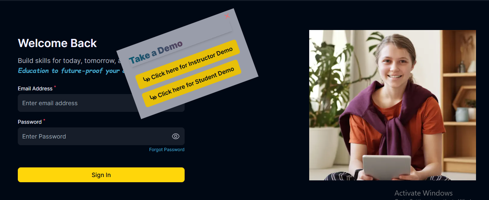
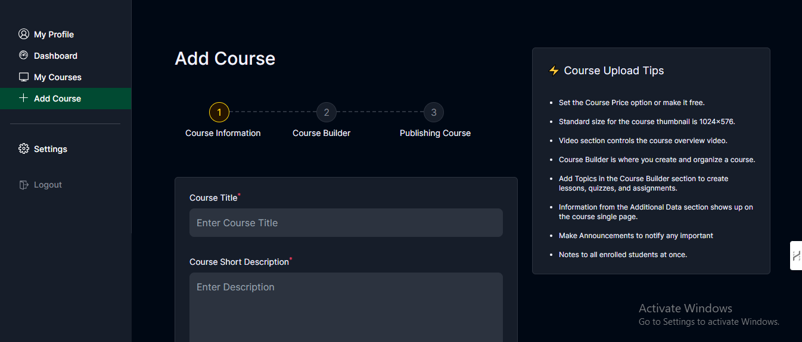
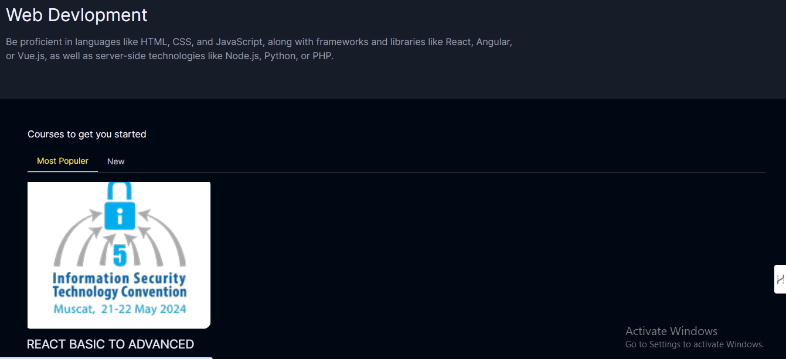

# Educraft

Educraft is an ED Tech (Education Technology) web application developed using the MERN stack.

### Login Page



### Course Builder Page



## Important

- Backend is in the server folder.
- Before uploading courses and anything create the categories e.g. web dev, Python, etc. (without categories courses cannot be added). To create categories create an Admin account and go to dashboard then admin panel.
- To create an Admin account first sign up with a student or instructor account then go to your Database under the users model and change that 'accountType' to 'Admin'.

## Installation

1. Clone the repository to your local machine.

   ```sh
   git clone https://github.com/zafarimam8588/Educraft.git
   ```

2. Install the required packages.

   ```sh
   cd educraft
   cd client
   npm install

   cd server
   npm install
   ```

3. Set up the environment variables:

   Create a .env file in the root directory and /server
   Add the required environment variables, such as database connection details, JWT secret, and any other necessary configurations check .env.example files for more info.

4. Start the development server.

   ```sh
   npm run dev
   ```

5. Open the project in your browser at [`http://localhost:3000`](http://localhost:3000) to view your project.

## System Architecture

The StudyNotion EdTech platform consists of three main components: the front-end, the back-end, and the database. The platform follows a client-server architecture, with the front-end serving as the client and the back-end and database serving as the server.

### Front-end

The front-end of the platform is built using ReactJS, which allows for the creation of dynamic and responsive user interfaces, crucial for providing an engaging learning experience to students. The front-end communicates with the back-end using RESTful API calls.

##### Homepage


##### Course Page



#### Front End Pages

For Students:

- **Homepage:** A brief introduction to the platform with links to the course list and user details.
- **Course List:** A list of all the courses available on the platform, along with their descriptions and ratings.
- **Wishlist:** Displays all the courses that a student has added to their wishlist.
- **Cart Checkout:** Allows the user to complete course purchases.
- **Course Content:** Presents the course content for a particular course, including videos and related material.
- **User Details:** Provides details about the student's account, including their name, email, and other relevant information.
- **User Edit Details:** Allows students to edit their account details.

For Instructors:

- **Dashboard:** Offers an overview of the instructor's courses, along with ratings and feedback for each course.
- **Insights:** Provides detailed insights into the instructor's courses, including the number of views, clicks, and other relevant metrics.
- **Course Management Pages:** Enables instructors to create, update, and delete courses, as well as manage course content and pricing.
- **View and Edit Profile Details:** Allows instructors to view and edit their account details.

#### Front-end Tools and Libraries

To build the front-end, we use frameworks and libraries such as ReactJS, CSS, and Tailwind for styling, and Redux for state management.

### Back-end

The back-end of the platform is built using NodeJS and ExpressJS, providing APIs for the front-end to consume. These APIs include functionalities such as user authentication, course creation, and course consumption. The back-end also handles the logic for processing and storing the course content and user data.

#### Back-end Features

- **User Authentication and Authorization:** Students and instructors can sign up and log in to the platform using their email addresses and passwords. The platform also supports OTP (One-Time Password) verification and forgot password functionality for added security.
- **Course Management:** Instructors can create, read, update, and delete courses, as well as manage course content and media. Students can view and rate courses.
- **Payment Integration:** Students will purchase and enroll in courses by completing the checkout flow, followed by Razorpay integration for payment handling.
- **Cloud-based Media Management:** StudyNotion uses Cloudinary, a cloud-based media management service, to store and manage all media content, including images, videos, and documents.
- **Markdown Formatting:** Course content in document format is stored in Markdown format, allowing for easier display and rendering on the front-end.

#### Back-end Frameworks, Libraries, and Tools

The back-end of StudyNotion uses various frameworks, libraries, and tools to ensure its functionality and performance, including:

- **Node.js:** Used as the primary framework for the back-end.
- **Express.js:** Used as a web application framework, providing a range of features and tools for building web applications.
- **MongoDB:** Used as the primary database, providing a flexible and scalable data storage solution.
- **JWT (JSON Web Tokens):** Used for authentication and authorization, providing a secure and reliable way to manage user credentials.
- **Bcrypt:** Used for password hashing, adding an extra layer of security to user data.
- **Mongoose:** Used as an Object Data Modeling (ODM) library, providing a way to interact with MongoDB using JavaScript.

#### Data Models and Database Schema

The back-end of StudyNotion uses several data models and database schemas to manage data, including:

- **Student Schema:** Includes fields such as name, email, password, and course details for each student.
- **Instructor Schema:** Includes fields such as name, email, password, and course details for each instructor.
- **Course Schema:** Includes fields such as course name, description, instructor details, and media content

- User Authentication: Educraft provides secure user registration and authentication using JWT (JSON Web Tokens). Users can sign up, log in, and manage their
  profiles with ease.
- Courses and Lessons: Instructors can create and edit created courses. Students can enroll in courses, access course materials, and track their progress.
- Progress Tracking: Educraft allows students to track their progress in enrolled courses. They can view completed lessons, scores on quizzes and
  assignments, and overall course progress.
- Payment Integration: Educraft integrates with Razorpay for payment processing. Users can make secure payments for course enrollment and other services
  using various payment methods supported by Razorpay.
- Search Functionality: Users can easily search for courses, lessons, and resources using the built-in search feature. This makes it convenient to find relevant
  content quickly.
- Instructor Dashboard: Instructors have access to a comprehensive dashboard to view information about their courses, students, and income. The
  dashboard provides charts and visualizations to present data clearly and intuitively. Instructors can monitor the total number of students enrolled in
  each course, track course performance, and view their income generated from course sales.

The project is set up to use `postcss-cli` to process your CSS files. You can add your own `tailwind.config.js` file to customize your Tailwind setup.
